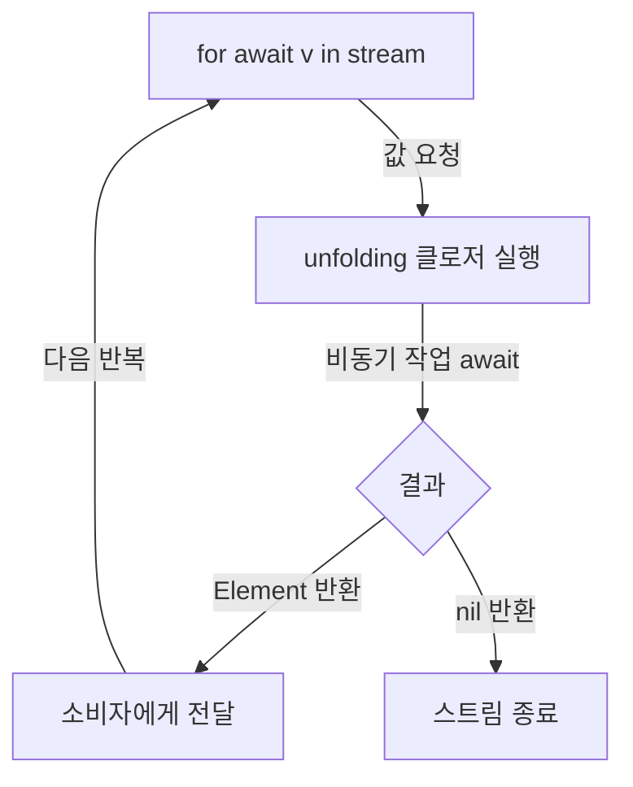
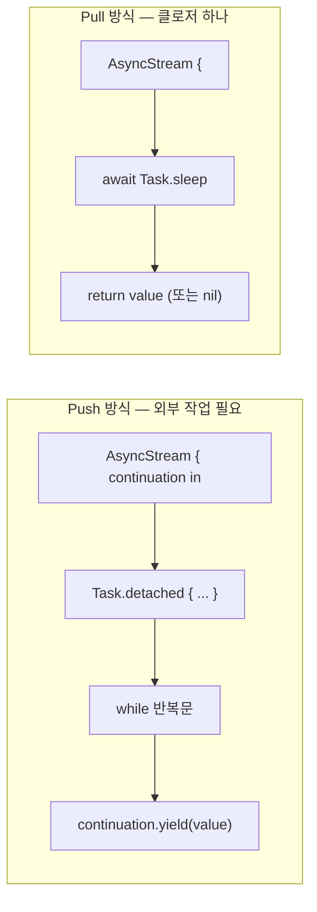

# AsyncStream - Pull 방식 (Unfolding 클로저)

AsyncStream(unfolding:) 생성자는 Swift Concurrency에서 값을 "당겨오는(Pull)" 방식으로 비동기 시퀀스를 생성하는 데 사용됩니다. 이 방식은 소비자가 다음 값을 요청할 때마다 비동기 클로저를 실행하여 값을 생성하고 반환합니다. `nil`을 반환하면 스트림이 종료됩니다.

### Pull 방식 작동 원리

`unfolding`이라는 용어는 함수형 프로그래밍에서 "씨앗 값에서 [[Swift-Sequence-프로토콜-이해하기|시퀀스]]를 펼쳐낸다(unfold)"는 의미에서 유래했습니다.
`AsyncStream(unfolding:)`에 전달되는 비동기 클로저는 다음 동작을 반복합니다.

1.  **값 요청**: `for await` 루프와 같은 소비자가 다음 값을 요청합니다.
2.  **클로저 실행**: `unfolding` 클로저가 실행됩니다.
3.  **비동기 작업**: 클로저 내부에서 비동기 작업을 수행하고 `Element?` 타입의 값을 생성합니다.
4.  **값 반환**: 생성된 값을 반환합니다.
5.  **스트림 종료**: `nil`을 반환하면 스트림이 종료됩니다.



### Push 방식 vs. Pull 방식

| 항목 | [[AsyncStream-Push-방식-Continuation|Push (Continuation)]] | **Pull (Unfolding)** |
| --- | --- | --- |
| 클로저 실행 시점 | 생성 시 1회 (동기 클로저) | 요청 시마다 (비동기 클로저) |
| 값 생산 주체 | 외부 코드가 `yield` | 클로저 내부에서 `return` |
| 종료 조건 | `continuation.finish()` | `nil` 리턴 |
| 에러 던지기 | `yield(with: .failure(...))` | 비동기 클로저에서 `throw` (Throwing 버전) |
| 주 용도 | 이벤트·콜백·델리게이트 | 폴링·반복 비동기 작업 |
| 비유 | "라디오 방송국이 전파를 쏨" | "도서관에서 책을 한 권씩 꺼내옴" |

### 기본적인 사용법

다음은 1초마다 숫자 7을 생성하는 `AsyncStream`의 Pull 방식 예시입니다.

```swift
let pullStream = AsyncStream {
    do {
        try await Task.sleep(for: .seconds(1))
        return 7
    } catch {
        return nil // Task 취소 시 CancellationError 발생, nil 리턴으로 스트림 종료
    }
} onCancel: {
    print("❌ 스트림이 취소되었습니다.")
}

let task = Task {
    for await v in pullStream {
        print("값:", v)
    }
}

// 5초 후 스트림을 소비하는 Task를 취소합니다.
try await Task.sleep(for: .seconds(5))
task.cancel() // -> onCancel 클로저 즉시 호출
```

**특징:**
1.  **`onCancel` 클로저**: `AsyncStream`의 `onTermination`과 유사하게 스트림 소비 태스크가 취소될 때 호출되며, 필요한 정리 작업을 수행합니다.
2.  **`Task.sleep`과 취소**: `Task.sleep`은 취소 가능한 비동기 작업입니다. 외부에서 `task.cancel()`을 호출하면 `CancellationError`를 던지기 때문에, `catch` 블록에서 `nil`을 반환해 스트림을 정상 종료해야 합니다.

🔗 **공식문서**: [AsyncStream init(_:onCancel:)](https://developer.apple.com/documentation/swift/asyncstream)

### 외부 상태를 이용한 종료 조건 설정

대부분의 스트림은 언젠가 종료되어야 합니다. 클로저 외부의 지역 변수를 캡처하여 스트림의 종료 조건을 만들 수 있습니다.

```swift
func makeCounterStream(max: Int) -> AsyncStream<Int> {
    var current = 0 // 클로저가 캡처하여 상태 유지
    return AsyncStream {
        guard current < max else { return nil } // 종료 조건
        try? await Task.sleep(for: .milliseconds(500))
        current += 1
        return current
    }
}

Task {
    for await n in makeCounterStream(max: 5) {
        print(n) // 1, 2, 3, 4, 5 출력 후 자동 종료
    }
    print("스트림 종료")
}
```

`current` 변수는 클로저 외부의 지역 변수이지만, 클로저가 이를 캡처하여 각 호출 사이에 상태가 유지됩니다. 이 점이 Pull 방식 클로저의 중요한 특징입니다.

### 에러 처리: `AsyncThrowingStream`

비동기 작업 중 에러가 발생할 수 있다면 `AsyncThrowingStream`을 사용합니다.

```swift
enum FeedError: Error {
    case unavailable
}

let throwingPullStream = AsyncThrowingStream {
    try await Task.sleep(for: .seconds(1))
    if Bool.random() {
        throw FeedError.unavailable // 클로저에서 직접 throw
    }
    return UUID().uuidString
}

Task {
    do {
        for try await id in throwingPullStream {
            print("ID:", id)
        }
    } catch {
        if error is CancellationError {
            print("작업 취소됨")
        } else {
            print("에러 발생:", error.localizedDescription)
        }
    }
}
```

💡 **`AsyncThrowingStream`의 `onCancel` 클로저**: `AsyncThrowingStream`의 `unfolding` 버전에는 별도의 `onCancel` 클로저가 없습니다. 취소 시 내부 `await` 지점에서 `CancellationError`가 자동으로 던져져 스트림 소비 태스크의 `catch` 블록으로 전달되기 때문입니다. 정리 작업이 필요하다면 `defer`나 `catch` 블록 안에서 처리할 수 있습니다.

```swift
let stream = AsyncThrowingStream {
    defer {
        // 호출이 끝날 때마다 실행됨 (정상 종료, 에러, 취소 모두 포함)
    }
    try await someWork()
    return "결과"
}
```

### Pull 방식 활용 예제

#### 예제 1: 주기적 서버 상태 폴링

정해진 간격마다 서버 상태를 확인하는 폴링 작업을 구현할 수 있습니다.

```swift
struct ServerStatus: Codable {
    let isOnline: Bool
    let userCount: Int
}

func serverStatusStream(
    every interval: Duration = .seconds(5)
) -> AsyncThrowingStream<ServerStatus, Error> {
    AsyncThrowingStream {
        try await Task.sleep(for: interval) // 지정된 간격만큼 대기
        let url = URL(string: "https://api.example.com/status")!
        let (data, _) = try await URLSession.shared.data(from: url)
        return try JSONDecoder().decode(ServerStatus.self, from: data)
    }
}

Task {
    do {
        for try await status in serverStatusStream() {
            print("서버 상태:", status)
            // updateUI(with: status) // UI 업데이트 로직
        }
    } catch {
        print("폴링 중단:", error)
    }
}
```

별도의 `Timer`나 복잡한 작업 관리가 필요 없으며, 스트림을 소비하는 `Task`가 취소되면 `Task.sleep`이 `CancellationError`를 던져 자동 정리됩니다.

#### 예제 2: UUID 무한 생성 스트림 (생성 로직 분리)

값 생성 로직과 스트림 래퍼를 분리해 구현하는 예시입니다.

```swift
func produceValue(shouldTerminate: Bool) async -> String? {
    try? await Task.sleep(for: .seconds(1))
    guard !shouldTerminate else { return nil }
    return UUID().uuidString
}

func makeUUIDStream(values: Int) -> AsyncStream<String> {
    var count = 0
    return AsyncStream(unfolding: {
        let value = await produceValue(shouldTerminate: count == values)
        count += 1
        return value
    })
}

Task {
    for await id in makeUUIDStream(values: 5) {
        print(id)
    }
    print("스트림 종료")
}
```

`produceValue`는 테스트 가능한 순수 비동기 함수로, `makeUUIDStream`은 이를 시퀀스 형태로 노출하는 얇은 래퍼 역할을 합니다.

### Push 방식과 Pull 방식 비교 예제

"1초마다 1부터 5까지 세기"라는 동일한 동작을 Push 방식과 Pull 방식으로 각각 구현한 예시입니다.

```swift
let howHigh = 5

// (A) Push 방식 — 내부에 Task와 while 반복문 필요
let pushStream = AsyncStream(Int.self) { continuation in
    Task.detached {
        var current = 1
        while current <= howHigh {
            try? await Task.sleep(for: .seconds(1))
            continuation.yield(current)
            current += 1
        }
        continuation.finish()
    }
}

// (B) Pull 방식 — 클로저 하나로 구현 가능
var current = 1
let pullStream = AsyncStream<Int> {
    guard current <= howHigh else { return nil }
    try? await Task.sleep(for: .seconds(1))
    defer { current += 1 } // 값을 반환한 후 current 증가
    return current
}
```



Pull 방식이 코드 길이가 더 짧을 수 있지만, 항상 더 좋은 것은 아니며 각 방식의 적합한 사용 상황이 다릅니다.

### 언제 Pull을, 언제 Push를 사용할까?

#### Pull 방식이 적합한 경우

*   **주기적 폴링**: 서버 상태, 센서 값, 알림 큐 등을 일정 간격으로 확인하여 가져올 때.
*   **순차적 비동기 작업**: 이전 작업이 완료되어야 다음 작업이 의미 있는 경우.
*   **외부 이벤트가 없는 데이터 소스**: 우리가 능동적으로 데이터를 가져와야 할 때.
*   **간단한 무한 시퀀스**: UUID 생성기, 카운터, 의사 난수 생성 등.

#### [[AsyncStream-Push-방식-Continuation|Push 방식]]이 적합한 경우

*   **외부 이벤트 소스**: 델리게이트, 콜백, NotificationCenter, WebSocket 등 외부에서 비동기적으로 발생하는 이벤트를 처리할 때.
*   **언제 도착할지 모르는 비동기 이벤트**: 데이터 도착 시점이 불확실한 경우.
*   **여러 곳에서 값을 흘려보내는 경우 (Multi-producer)**.
*   **버퍼링이 필요한 경우**: 소비자가 잠시 값을 받지 못해도 값이 사라지지 않아야 할 때.

💡 **참고**: 실제로 Push 방식은 콜백/델리게이트 패턴을 Swift Concurrency로 전환하기에 더 자연스러워 사용 빈도가 높습니다. Pull 방식은 특정 패턴(폴링)에 강점을 보이지만, `Task`와 `while` 루프를 사용해서도 비슷한 기능을 구현할 수 있어 선택의 여지가 있습니다.

### Pull 방식에서 자주 하는 실수

#### 실수 1: 종료 조건 누락

```swift
// ❌ 의도치 않은 무한 스트림 (소비자가 break/cancel 하지 않으면 영원히 실행됨)
let bad = AsyncStream {
    try? await Task.sleep(for: .seconds(1))
    return Int.random(in: 0...100)
}
```

이는 반드시 잘못된 코드는 아니지만, "끝없는 스트림"이라는 점을 인지하지 못하면 메모리/CPU 누수로 이어질 수 있습니다. 의도적으로 무한 스트림이 아니라면 종료 조건을 명시해야 합니다.

#### 실수 2: `AsyncStream`에서 `try?` 없이 `Task.sleep` 호출

`AsyncStream`의 `unfolding` 클로저는 `async`로 선언되지만 `throws`로 선언되지 않습니다. 따라서 `throws`가 있는 `Task.sleep`을 호출할 때는 `try?`로 감싸야 합니다.

```swift
// ❌ AsyncStream 클로저는 throws가 아니므로 컴파일 에러 발생
let stream = AsyncStream {
    await Task.sleep(for: .seconds(1)) // 컴파일 에러: 'await' in a function that does not support concurrency
    return 7
}

// ✅ try?로 감싸서 CancellationError를 처리 (취소 시 sleep이 throw함)
let stream2 = AsyncStream {
    try? await Task.sleep(for: .seconds(1))
    return 7
}
```

#### 실수 3: 클로저 캡처 변수의 동시성 문제

Pull 방식의 `unfolding` 클로저는 한 번에 하나의 소비자가 호출하도록 직렬화되지만, 외부에서 같은 변수를 동시에 접근하면 여전히 동시성 문제가 발생할 수 있습니다.

```swift
// ⚠️ 여러 곳에서 같은 스트림을 소비하면 'current' 변수에 대한 경합 조건(race condition) 발생
var current = 0
let stream = AsyncStream<Int> {
    current += 1 // 경합 조건 발생 가능!
    try? await Task.sleep(for: .seconds(1))
    return current
}
```

상태는 가급적 클로저 내부에 가두거나, `actor`와 같은 동시성 안전 메커니즘으로 보호해야 합니다.

### 요약

*   Pull 방식은 **소비자의 요청에 응답하여 `unfolding` 클로저가 매번 실행**됩니다.
*   스트림의 종료는 **`nil` 반환**으로, 에러 처리는 **`throw`** (AsyncThrowingStream의 경우)로 이루어집니다.
*   취소 핸들러는 `onCancel:` 클로저로 제공되지만, `AsyncThrowingStream`에는 없으며 취소 시 자동으로 `CancellationError`가 던져집니다.
*   주기적 폴링, 순차 비동기 작업에 특히 적합합니다.
*   의도치 않은 무한 스트림이 되지 않도록 종료 조건을 명확히 설정하는 것이 중요합니다.

### 참고 자료

*   [AsyncStream — Apple Developer Documentation](https://developer.apple.com/documentation/swift/asyncstream)
*   [AsyncThrowingStream — Apple Developer Documentation](https://developer.apple.com/documentation/swift/asyncthrowingstream)
*   [Unfold — Nabil Hassein's Blog](https://nabilhassein.github.io/blog/unfold/)
