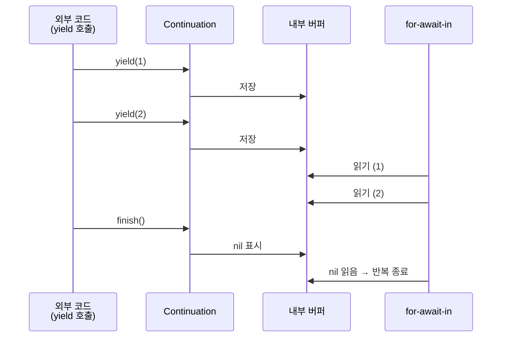
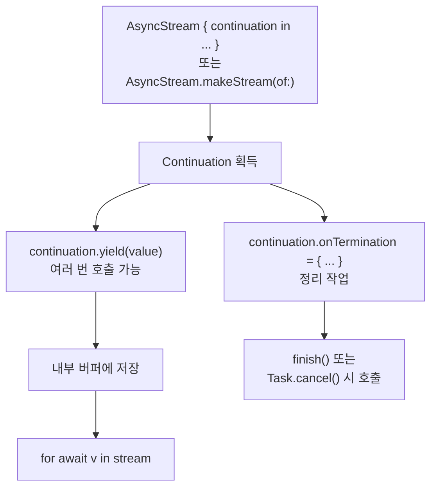

# AsyncStream - Push 방식 (Continuation 기반)

팀 iOS 프로젝트에서 비동기 이벤트를 효과적으로 다루기 위해 `AsyncStream`의 Push 방식을 활용하는 방법을 알아봅니다. 이 방식은 외부에서 스트림으로 값을 `yield`하여 전달합니다.

## 0. AsyncSequence와 AsyncStream
`AsyncSequence`는 Swift Concurrency에서 여러 값을 비동기적으로 생성하는 시퀀스를 추상화한 프로토콜입니다. `AsyncStream`은 이 `AsyncSequence` 프로토콜을 채택하는 구조체로, 복잡한 보일러플레이트 코드 없이 클로저를 통해 쉽게 비동기 시퀀스를 만들 수 있도록 돕습니다.

> 🔗 **관련 문서**: [[Swift-AsyncSequence-이해-및-활용]]

## 1. 두 가지 AsyncStream 생성 방식
`AsyncStream`은 두 가지 주요 생성 방식을 제공하며, 각각 데이터 흐름과 클로저 호출 시점에서 정반대로 동작합니다.

| 방식                 | 데이터 흐름       | 클로저 호출 시점 | 주 용도                                 |
| :------------------- | :---------------- | :--------------- | :-------------------------------------- |
| **Push (Continuation 기반)** | 외부 → 스트림     | 생성 시 1회      | 콜백 / 델리게이트 / 이벤트 소스 전환    |
| [[AsyncStream-Pull-방식-Unfolding-클로저|Pull (unfolding 클로저)]] | 스트림이 외부에 요청 | 값이 요청될 때마다 | 반복 폴링 / 순차 비동기 작업            |

이 문서에서는 **Push 방식 (Continuation 기반)**에 대해 깊이 있게 다룹니다.

## 2. 기본 사용법
`AsyncStream`의 Continuation 기반 스트림은 생성 시점에 클로저가 한 번 실행되며, 이 클로저 내에서 `continuation.yield(값)`을 호출하여 스트림에 값을 흘려보냅니다. `continuation.finish()`를 호출하면 스트림이 종료됩니다.

```swift
let stream = AsyncStream<Int> { continuation in
    continuation.yield(1)                    // 값 흘려보내기
    continuation.yield(2)
    continuation.yield(with: .success(3))    // .success / .failure 모두 사용 가능
    continuation.finish()                    // 종료 신호 (= 더 이상 값 없음)
}

Task {
    for await value in stream {
        print("받은 값:", value)
    }
}
// 출력: 받은 값: 1, 받은 값: 2, 받은 값: 3 후 반복 종료
```

*   `continuation.yield(값)`: 값을 스트림에 흘려보냅니다. `for-await-in` 루프는 다음 차례에 이 값을 받습니다.
*   `continuation.finish()`: 스트림이 더 이상 값을 생성하지 않음을 알립니다. 호출되면 `for-await-in` 루프가 종료됩니다.

> 🔗 **공식 문서**: [AsyncStream.Continuation](https://developer.apple.com/documentation/swift/asyncstream/continuation)

## 3. 내부 동작 원리 (버퍼링 메커니즘)
`AsyncStream`은 값을 `yield`하면 내부 버퍼에 잠시 보관합니다. 이는 소비자가 값을 느리게 읽더라도 값이 손실되지 않도록 보장합니다.



*   소비자가 늦게 값을 요청해도 `yield`된 값은 버퍼에 쌓여 기다립니다 (기본 정책 기준).
*   소비자가 빨라서 버퍼가 비어 있으면, 다음 `yield` 호출이 있을 때까지 `for-await-in` 루프는 suspend 상태로 대기합니다.

## 4. 주요 특징
Continuation 기반 `AsyncStream`의 핵심 특징 5가지입니다.

1.  **클로저는 생성 시점에 한 번만 실행**: `AsyncStream { ... }` 코드가 실행되는 즉시 클로저 내부의 코드가 실행되고 완료됩니다. `for-await-in` 루프가 시작될 때마다 실행되는 것이 아닙니다.
2.  **버퍼링이 기본**: `yield`된 값은 소비자가 가져갈 때까지 내부 버퍼에서 대기합니다.
3.  **`continuation`은 `Sendable`**: `continuation` 객체는 `Sendable` 프로토콜을 준수하므로, 외부 변수에 저장해두고 클로저 바깥의 다른 태스크나 액터에서 안전하게 호출할 수 있습니다.
4.  **스트림 자체에는 `cancel()`이 없음**: 스트림의 데이터 흐름을 멈추려면, 해당 스트림을 소비하는 `Task`를 취소해야 합니다.
5.  **`yield`는 여러 번 호출 가능**: `withCheckedContinuation`의 컨티뉴에이션은 정확히 한 번만 호출해야 하지만, `AsyncStream.Continuation`은 원하는 만큼 여러 번 `yield`할 수 있습니다.

## 5. 버퍼링 정책 (`BufferingPolicy`)
`AsyncStream`은 소비자가 느릴 때 버퍼가 어떻게 동작할지 `BufferingPolicy`를 통해 설정할 수 있습니다. 이는 메모리 사용량을 제어하고 데이터의 중요도에 따라 처리 방식을 결정합니다.

```swift
// (1) 제한 없음 (.unbounded) — 기본값. 메모리 사용량 주의
let s1 = AsyncStream(Int.self, bufferingPolicy: .unbounded) { _ in }

// (2) 가장 오래된 값 N개만 유지 (.bufferingOldest(N)) — N개 초과 시 오래된 값 무시
let s2 = AsyncStream(Int.self, bufferingPolicy: .bufferingOldest(10)) { _ in }

// (3) 가장 최신 값 N개만 유지 (.bufferingNewest(N)) — N개 초과 시 오래된 값 버림 (실시간 데이터에 유용)
let s3 = AsyncStream(Int.self, bufferingPolicy: .bufferingNewest(1)) { _ in }
```

*   `.unbounded`: 모든 값이 중요하고 소비자가 충분히 빠르다고 확신할 때 사용합니다 (예: 이벤트 로그, 메시지 큐).
*   `.bufferingOldest(N)`: 초반 데이터가 더 중요한 경우에 사용합니다 (예: 인증 토큰 발급 흐름).
*   `.bufferingNewest(N)`: 최신 값만 의미 있는 경우에 사용합니다 (예: 실시간 시세, 현재 위치, 검색창 텍스트 등. 대부분의 UI 시나리오에 적합).

## 6. 스트림 종료 및 리소스 정리 (`onTermination`)
스트림이 정상적으로 종료되거나 외부에서 취소될 때, 타이머 해제, 소켓 닫기 등 필요한 정리 작업을 수행해야 하는 경우가 있습니다. 이때 `onTermination` 핸들러를 사용합니다.

```swift
let stream = AsyncStream(Int.self, bufferingPolicy: .unbounded) { continuation in
    print("🟢 방출 시작")

    // 스트림 종료/취소 시 호출되는 핸들러 등록
    continuation.onTermination = { termination in
        switch termination {
        case .finished:  print("✅ 정상 종료")
        case .cancelled: print("❌ 취소됨")
        @unknown default: break
        }
    }

    continuation.yield(1)
    sleep(1)
    continuation.yield(2)
    sleep(1)
    continuation.yield(3)
    continuation.finish()         // -> onTermination(.finished) 호출
}

Task {
    for await v in stream { print(v) }
}
```

`onTermination` 핸들러는 다음 두 가지 경우에 호출됩니다.

*   `.finished`: `continuation.finish()`가 호출되어 스트림이 정상적으로 종료될 때.
*   `.cancelled`: 스트림을 소비하는 `Task`가 외부에서 취소될 때.

리소스 정리는 `onTermination` 핸들러 내에서 수행하는 것이 가장 안전하며, 어떤 경로로 스트림이 종료되든 리소스 누수를 방지할 수 있습니다.

## 7. 에러 처리 (`AsyncThrowingStream`)
값뿐만 아니라 에러도 스트림을 통해 흘려보내고 싶다면 `AsyncThrowingStream`을 사용합니다.

```swift
enum DataError: Error { case network }

let stream = AsyncThrowingStream<Int, Error> { continuation in
    continuation.onTermination = { _ in print("종료/취소") }

    continuation.yield(1)
    continuation.yield(2)
    continuation.yield(with: .failure(DataError.network))   // 에러 방출
    // 에러 방출 이후의 yield는 무시됩니다.
}

Task {
    do {
        for try await v in stream {
            print("값:", v)
        }
    } catch {
        print("에러 처리:", error)
    }
}
// 출력: 값: 1, 값: 2, 에러 처리: network
```

`yield(with:)` 메서드는 `Result` 타입을 인자로 받아 성공 또는 실패를 스트림으로 전달할 수 있습니다. 중요한 점은 **에러가 한 번 방출되면 스트림은 즉시 종료되며, 그 이후의 `yield` 호출은 무시됩니다.**

> 🔗 **공식 문서**: [AsyncThrowingStream](https://developer.apple.com/documentation/swift/asyncthrowingstream)

## 8. 가장 흔한 실전 패턴: `makeStream(of:)`
`continuation`을 클로저 바깥에서 사용하기 위해 외부 변수에 캡처하는 패턴이 흔하게 사용되었는데, 이를 더 간결하게 처리하기 위해 `AsyncStream.makeStream(of:)` 정적 메서드가 제공됩니다.

```swift
// 신형 패턴 — 스트림과 continuation을 튜플로 한 번에 받기
let (stream, continuation) = AsyncStream.makeStream(
    of: Int.self,
    bufferingPolicy: .unbounded
)

// 어디서든 자유롭게 continuation 호출 가능
continuation.yield(1)
continuation.yield(2)
continuation.finish()

Task {
    for await n in stream { print(n) }
}
```

`makeStream`은 스트림과 해당 `Continuation`을 튜플로 반환하여, 외부 변수에 캡처할 필요 없이 코드를 더 깔끔하게 작성할 수 있게 해줍니다.

> 🔗 **공식 문서**: [makeStream(of:bufferingPolicy:)](https://developer.apple.com/documentation/swift/asyncstream/makestream(of:bufferingpolicy:))
> 🔗 **공식 문서**: [AsyncThrowingStream.makeStream](https://developer.apple.com/documentation/swift/asyncthrowingstream/makestream(of:throwing:bufferingpolicy:))

## 9. 실전 예제 1: 카운트다운 스트림
5초 카운트다운을 비동기 시퀀스로 구현하는 예제입니다.

```swift
func countdownStream(
    from: Int,
    interval: Duration = .seconds(1)
) -> AsyncStream<Int> {
    AsyncStream { continuation in
        // 별도의 Task에서 yield
        let task = Task.detached {
            for n in stride(from: from, through: 0, by: -1) {
                try? await Task.sleep(for: interval)
                continuation.yield(n)
            }
            continuation.finish()
        }
        // 바깥에서 취소되면 내부 Task도 같이 정리
        continuation.onTermination = { _ in
            task.cancel()
        }
    }
}

Task {
    for await n in countdownStream(from: 5) {
        print("⏱️ \(n)")
    }
    print("🚀 발사!")
}
```

이 예제에서는 `onTermination` 핸들러 내에서 내부 `Task`를 취소하는 부분이 중요합니다. 소비하는 `Task`가 취소되면 `onTermination(.cancelled)`가 호출되고, 이 안에서 관련 리소스를 정리(`task.cancel()`)하여 취소 전파를 구현합니다. 이는 실전 스트림에서 매우 일반적인 패턴입니다.

## 10. 실전 예제 2: SwiftUI 검색 입력 스트림
사용자가 SwiftUI 검색창에 입력할 때마다 해당 텍스트를 비동기 시퀀스로 흘려보내는 패턴입니다. `Combine`의 `@Published`와 `debounce` 조합을 대체할 수 있습니다.

```swift
final class KeystrokeService {
    let stream: AsyncStream<String>
    private let continuation: AsyncStream<String>.Continuation

    init() {
        // bufferingNewest(1) — 직전 입력은 의미 없으므로 최신값만 유지
        (stream, continuation) = AsyncStream.makeStream(
            of: String.self,
            bufferingPolicy: .bufferingNewest(1)
        )
    }

    func type(_ text: String) {
        continuation.yield(text)
    }

    deinit {
        continuation.finish()    // 객체 해제 시 안전하게 스트림 종료
    }
}

struct SearchView: View {
    let service = KeystrokeService()
    @State var query = ""
    @State var results: [String] = []

    var body: some View {
        VStack {
            TextField("검색", text: $query)
                .onChange(of: query) { _, new in service.type(new) }

            List(results, id: \.self) { Text($0) }
        }
        .task {
            // 입력값을 받아서 서버로 검색 요청
            for await text in service.stream {
                results = await search(query: text)
            }
        }
    }

    func search(query: String) async -> [String] {
        // 실제 검색 로직 (예: 서버 API 호출)
        return []
    }
}
```

`.bufferingNewest(1)` 정책을 사용하여 사용자가 빠르게 타이핑할 때 중간 입력값을 버리고 최신 값만 유지함으로써, 불필요한 검색 요청을 줄여 효율성을 높일 수 있습니다.

## 11. 실전 예제 3: Multi-Producer 이벤트 허브
여러 출처에서 동일한 스트림으로 값을 흘려보내는 `EventBus` 또는 `EventEmitter`와 같은 구조를 구현할 때 유용합니다.

```swift
actor EventHub {
    let stream: AsyncStream<String>
    private let continuation: AsyncStream<String>.Continuation

    init() {
        (stream, continuation) = AsyncStream.makeStream(of: String.self)
    }

    // Continuation은 Sendable이므로 nonisolated로 열어도 안전
    nonisolated func emit(_ event: String) {
        continuation.yield(event)
    }

    nonisolated func close() {
        continuation.finish()
    }
}

let hub = EventHub()

// 여러 곳에서 이벤트를 emit
Task.detached { await hub.emit("사용자 로그인") }
Task.detached { await hub.emit("프로필 조회") }
Task.detached { await hub.emit("푸시 수신") }

// 한 곳에서 이벤트를 소비
Task {
    for await event in hub.stream {
        print("📢 이벤트:", event)
    }
}
```

`Continuation`이 `Sendable` 프로토콜을 준수하므로, 여러 스레드나 액터에서 동시에 `yield`를 호출해도 안전합니다. 이는 채팅 메시지 수신, 로그 수집, 푸시 알림 처리 등 다양한 분산 이벤트 처리 시나리오에 활용될 수 있습니다.

## 12. 취소 처리 메커니즘
`AsyncStream` 자체에는 `cancel()` 메서드가 없습니다. 스트림의 데이터 흐름을 멈출지 말지는 해당 흐름을 소비하는 `Task`의 책임입니다. 따라서 `Task.cancel()`이 모든 취소 작업의 출발점이 됩니다.

```swift
let (stream, continuation) = AsyncStream<Int>.makeStream()

continuation.onTermination = { termination in
    print("종료 사유:", termination)
    // 여기서 외부 리소스 정리
    //  - 타이머 invalidate
    //  - 소켓 close
    //  - 옵저버 remove
    //  - DB 커넥션 반환
}

let task = Task {
    for await n in stream {
        print(n)
    }
}

// 3초 뒤 바깥에서 Task 취소
try? await Task.sleep(for: .seconds(3))
task.cancel()    // -> onTermination(.cancelled) 호출됨
```

이 예제는 `Task.cancel()`이 호출되었을 때 `onTermination(.cancelled)`가 트리거되어 리소스 정리가 이루어지는 과정을 보여줍니다. 스트림은 데이터 흐름을 제공할 뿐, 해당 흐름의 생명주기를 직접 제어하는 것은 소비하는 `Task`의 역할입니다.

## 핵심 요약



*   **Push 방식**: `yield()`를 외부에서 호출하여 값을 스트림으로 밀어넣는 구조.
*   **버퍼링 정책**: `.unbounded`, `.bufferingOldest(n)`, `.bufferingNewest(n)` 중 선택하여 메모리 및 데이터 처리 방식 제어.
*   **스트림 종료**: `continuation.finish()` 호출.
*   **스트림 취소**: 스트림을 소비하는 `Task.cancel()` 호출 시 `onTermination(.cancelled)`가 트리거.
*   **실전 패턴**: `AsyncStream.makeStream(of:)`를 사용하여 `continuation`을 객체 프로퍼티로 보관하고 외부에서 `yield`.

## 마무리
지금까지 살펴본 Push 방식은 외부에서 스트림 안으로 값을 밀어넣는 구조였습니다. `AsyncStream`에는 이와 정반대 방향으로, 스트림이 다음 값이 필요할 때마다 값을 생성하여 돌려주는 방식도 있는데, 이를 **Pull 방식 (unfolding 클로저)**이라고 부릅니다.

> 🔗 **관련 문서**: [[AsyncStream-Pull-방식-Unfolding-클로저]]
> 🔗 **고수준 가이드**: [[AsyncStream-Combine-비동기-기술-선택-가이드]]

**공식 문서 참고 자료:**

*   [AsyncStream — Apple Developer](https://developer.apple.com/documentation/swift/asyncstream)
*   [AsyncStream.Continuation — Apple Developer](https://developer.apple.com/swift/documentation/swift/asyncstream/continuation)
*   [AsyncThrowingStream — Apple Developer](https://developer.apple.com/documentation/swift/asyncthrowingstream)
*   [AsyncStream.makeStream(of:bufferingPolicy:)](https://developer.apple.com/documentation/swift/asyncstream/makestream(of:bufferingpolicy:))
