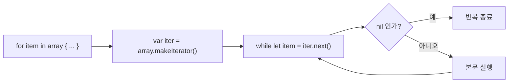
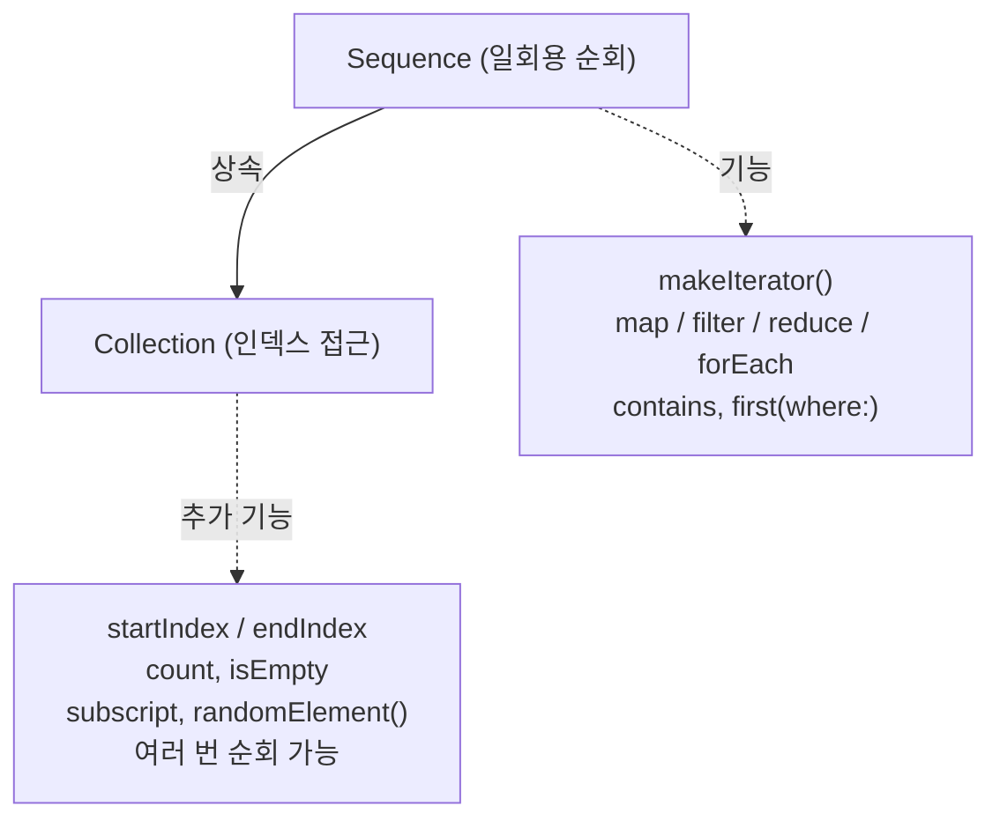

# Swift Sequence 프로토콜 이해하기

## Sequence 프로토콜

`Sequence`는 "한 번에 하나씩 값을 꺼낼 수 있는 능력"을 추상화한 프로토콜입니다. `Array`, `Set`, `Dictionary`, `Range`, `String` 같은 타입들은 모두 이 프로토콜을 채택하고 있어서 `for-in` 반복문에 들어갈 수 있습니다.

```swift
for item in [1, 2, 3] { }          // Array도
for c in "Hello" { }                // String도
for n in 1...10 { }                 // Range도
for (k, v) in ["a": 1, "b": 2] { }  // Dictionary도
```

반대로 말하면, `Sequence`를 채택하지 않은 타입은 `for-in`에 그대로 넣을 수 없습니다.

🔗 **공식 문서**: [Sequence](https://developer.apple.com/documentation/swift/sequence)

## for-in의 내부 동작 (while문)

`for-in`은 컴파일러가 내부적으로 `while` 반복문으로 변환하여 실행합니다. 아래 다이어그램과 **코드로** 그 과정을 이해할 수 있습니다.



```swift
// 우리가 쓰는 코드
let names = ["Allen", "Steve", "Jobs"]
for name in names {
    print(name)
}

// 컴파일러가 실제로 만드는 코드 (개념)
var iterator = names.makeIterator()       // 1. 반복자 생성
while let name = iterator.next() {         // 2. 하나씩 꺼냄
    print(name)
}                                          // 3. nil 나오면 종료
```

- `makeIterator()`: `Sequence` 프로토콜이 요구하는 메서드입니다. **반복자(Iterator) 객체를 만들어 반환**합니다.
- `next()`: `IteratorProtocol`이 요구하는 메서드입니다. **값을 하나씩 꺼내고, 더 이상 꺼낼 게 없으면 `nil`을 반환**합니다.

`Sequence`는 "반복자 만드는 공장"이며, 실제 값을 하나씩 꺼내는 일은 `IteratorProtocol`을 채택한 별도의 객체가 담당합니다.

🔗 **참고**: [반복자(위키백과)](https://ko.wikipedia.org/wiki/%EB%B0%98%EB%B3%B5%EC%9E%90)

> **`next()` 호출 규칙**: 한 번 `nil`을 반환한 반복자는 그 이후 호출에서도 **계속 `nil`을 반환해야 합니다**. 다시 값이 나오면 안 됩니다.

🔗 **공식 문서**: [IteratorProtocol](https://developer.apple.com/documentation/swift/iteratorprotocol)

## Sequence vs Collection

`Sequence`가 있다면 한 번쯤 들어봤을 `Collection`은 무엇일까요? 두 프로토콜은 상속 관계입니다.



-   **`Sequence`는 "일회용"입니다.** 한 번 순회하면 상태가 소진될 수 있습니다 (예: 네트워크 스트림). 인덱스도 없습니다.
-   **`Collection`은 "재사용 가능"합니다.** 여러 번 순회할 수 있고, `array[3]` 같은 인덱스 접근이 가능하며, `count`로 길이를 알 수 있습니다.
-   `Array`, `Dictionary`, `Set`은 모두 `Collection`이고, 따라서 자동으로 `Sequence`이기도 합니다.

이러한 차이점은 왜 [[Swift-AsyncSequence-이해-및-활용|AsyncSequence]]에는 `count`가 없고 `Collection` 프로토콜을 채택하지 않는지 **이유를 설명합니다**. 비동기 시퀀스는 값을 시간에 걸쳐 받아오므로, 미리 길이를 알 수도 없고 두 번 순회할 수도 없기 때문입니다.

🔗 **관련 페이지**: [[AsyncStream-Pull-방식-Unfolding-클로저]]
🔗 **공식 문서**: [Sequence and Collection Protocols](https://developer.apple.com/documentation/swift/sequence-and-collection-protocols), [Collection](https://developer.apple.com/documentation/swift/collection)

## 커스텀 타입에 `for-in` 적용하기 (분리형)

사용자 정의 구조체를 `for-in`에 넣고 싶다면, `Sequence`와 `IteratorProtocol`을 채택해야 합니다. 가장 정석적인 방법은 **반복자를 별도 타입으로 분리**하는 것입니다.

```swift
// 1. IteratorProtocol을 채택한 반복자 타입
struct CountdownIterator: IteratorProtocol {
    var current: Int
    // typealias Element = Int  <- next()의 리턴 타입으로 자동 추론되므로 생략 가능

    mutating func next() -> Int? {
        // 핵심 규칙: nil을 리턴하면 반복 종료
        guard current > 0 else { return nil }
        defer { current -= 1 }     // 다음 호출을 위해 감소
        return current
    }
}

// 2. Sequence를 채택한 시퀀스 타입
struct Countdown: Sequence {
    let from: Int

    // Sequence가 요구하는 메서드: 반복자를 만들어 돌려줍니다.
    func makeIterator() -> CountdownIterator {
        return CountdownIterator(current: from)
    }
}

// 사용 예시
for n in Countdown(from: 5) {
    print(n)   // 5, 4, 3, 2, 1
}
```

`Countdown` 자체는 "어디서부터 카운트할지"만 알고 있고, 실제로 값을 하나씩 꺼내는 일은 `CountdownIterator`가 담당합니다. 이렇게 분리하면 `makeIterator()`가 매번 새 반복자를 만들어 반환하기 때문에 **여러 번 `for-in`을 돌릴 수 있게 됩니다**.

```swift
let c = Countdown(from: 3)
for n in c { print(n) }   // 3, 2, 1
for n in c { print(n) }   // 3, 2, 1  <- 다시 처음부터!
```

### 왜 분리형이 표준 패턴이 되었을까요?

Swift 표준 라이브러리는 대부분 이 분리형으로 구현되어 있습니다 ([공식 문서: IndexingIterator](https://developer.apple.com/documentation/swift/indexingiterator) 참조).

이는 **시퀀스의 의미적 정체성과 반복 중의 임시 상태를 분리**하기 위함입니다.

-   **시퀀스**는 "어떤 데이터인가"를 표현합니다 (위 예시에서 `Countdown`은 "5에서 시작하는 카운트다운"이라는 정체성).
-   **반복자**는 "지금 어디까지 봤는가"라는 일회용 상태를 가집니다 (`CountdownIterator.current`가 진행 상태).

이러한 관점은 `AsyncSequence`와 `AsyncIterator` 관계에서도 유사하게 적용됩니다.

## 커스텀 타입에 `for-in` 적용하기 (동시 채택형)

매번 두 개의 타입을 만드는 것이 번거롭다면, 한 타입이 `Sequence`와 `IteratorProtocol`을 **동시에 채택**할 수도 있습니다. (자기 자신이 시퀀스이면서 반복자가 되는 구조)

```swift
struct Fibonacci: Sequence, IteratorProtocol {
    var current = 0
    var next_ = 1
    let limit: Int

    mutating func next() -> Int? {
        guard current < limit else { return nil }
        let result = current
        (current, next_) = (next_, current + next_)
        return result
    }
    // makeIterator()는 기본 구현(self를 리턴)이 제공되므로 따로 작성할 필요 없습니다.
}

for f in Fibonacci(limit: 100) {
    print(f)   // 0, 1, 1, 2, 3, 5, 8, 13, 21, 34, 55, 89
}
```

코드가 훨씬 짧아졌지만, **소진 조건**에 유의해야 합니다.

동시 채택 방식은 자기 자신이 곧 반복자입니다. 그래서 "한 번 순회하면 상태가 소진된다"고 이야기할 수 있기는 한데, 실제로는 **타입이 값 타입(struct)이냐 참조 타입(class)이냐에 따라 다릅니다.**

-   **값 타입 구조체**로 만든 동시 채택형은 `for-in`에 넣을 때마다 컴파일러가 **복사본**을 만들어 사용합니다. 따라서 같은 인스턴스로 `for-in`을 여러 번 돌려도 매번 처음부터 동작합니다.
- 하지만 **`next()`를 직접 호출**하거나, **클래스**로 만들거나, **참조를 내부에 들고 있다면** 한 번 소진된 후엔 계속 `nil`만 반환합니다.

```swift
// 케이스 1: for-in 두 번 — 값 타입이라 매번 복사돼서 OK
var fib = Fibonacci(limit: 50)
for f in fib { print(f) }   // 0, 1, 1, 2, 3, 5, 8, 13, 21, 34
for f in fib { print(f) }   // 0, 1, 1, 2, 3, 5, 8, 13, 21, 34 (정상 동작!)

// 케이스 2: next()를 직접 부르면 — 소진됨
var fib2 = Fibonacci(limit: 50)
while let f = fib2.next() { print(f) }   // 정상 출력
while let f = fib2.next() { print(f) }   // 아무것도 출력 안 됨 (소진됨)
```

**안전하게 여러 번 순회를 보장하고 싶다면 분리형을 쓰는 것이 좋습니다.** 동시 채택형은 "내부 상태가 한 번에 한 방향으로만 흘러간다"는 것을 자기 자신의 구조로 보여주므로, 의미상 일회용 스트림에 가깝습니다.

## 함수형 메서드 자동 제공

`Sequence`를 채택하기만 하면 `map`, `filter`, `reduce`, `forEach`, `contains`, `first(where:)` 같은 함수형 메서드를 자동으로 사용할 수 있습니다. 이는 Swift의 프로토콜 익스텐션 덕분입니다.

```swift
let evens = Countdown(from: 10).filter { $0 % 2 == 0 }
let sum   = Countdown(from: 10).reduce(0, +)
let doubled = Countdown(from: 10).map { $0 * 2 }

print(evens)    // [10, 8, 6, 4, 2]
print(sum)      // 55
print(doubled)  // [20, 18, 16, 14, ...]
```

`Countdown` 타입에는 `filter`, `reduce`, `map`을 한 줄도 작성하지 않았지만, `Sequence`만 채택했는데도 모두 사용 가능합니다. **이 패턴은 `AsyncSequence`에서도 똑같이 재현됩니다.**

## 타입 지우기 (Type Erasing) - AnySequence, AnyIterator

가끔 시퀀스를 외부에 노출할 때 구체 타입 (`Countdown`, `CountdownIterator` 등)을 숨기고 싶을 수 있는데, 이때는 타입 지우기(type-erasing) 래퍼인 `AnySequence`나 `AnyIterator`를 사용할 수 있습니다.

```swift
func makeNumbers() -> AnySequence<Int> {
    return AnySequence(Countdown(from: 5))
}

for n in makeNumbers() {   // 타입은 AnySequence<Int>로 노출됨
    print(n)
}
```

이러한 개념은 참고하시면 됩니다.

### 참고 자료

*   [Sequence — Apple Developer Documentation](https://developer.apple.com/documentation/swift/sequence)
*   [IteratorProtocol — Apple Developer Documentation](https://developer.apple.com/documentation/swift/iteratorprotocol)
*   [Collection — Apple Developer Documentation](https://developer.apple.com/documentation/swift/collection)
*   [AnySequence — Apple Developer Documentation](https://developer.apple.com/documentation/swift/anysequence)
