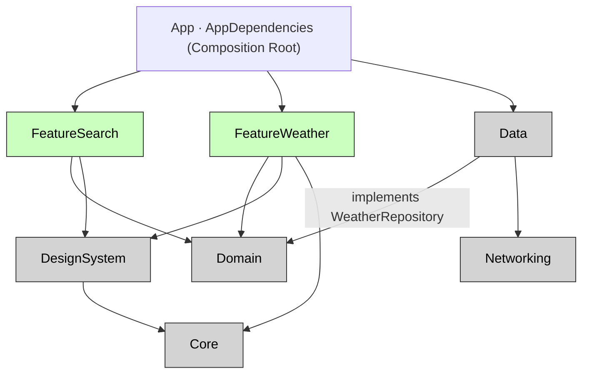

# 모듈화 전략: 레이어 vs 기능 및 하이브리드 접근법

## 0. 개요
팀 프로젝트의 효율적인 코드 베이스 관리를 위해 모듈화 전략의 중요성을 이해하고 레이어별, 기능별 접근 방식의 장단점을 분석합니다. 궁극적으로 팀 프로젝트에 적합한 하이브리드 모듈화 전략을 제안하며, 새로운 코드를 배치하는 가이드를 제공합니다.

## 1. 모듈화의 필요성
모듈화는 코드를 논리적이고 독립된 단위로 분리하여 다음과 같은 이점을 제공합니다.
*   **코드 응집도 향상**: 관련된 코드를 한곳에 모아 관리합니다.
*   **결합도 감소**: 모듈 간 의존성을 줄여 변경의 파급 효과를 최소화합니다.
*   **재사용성 증가**: 독립된 모듈은 다른 프로젝트나 기능에서 쉽게 재사용할 수 있습니다.
*   **빌드 및 테스트 성능 향상**: 특정 모듈만 빌드 및 테스트하여 개발 속도를 높입니다.
*   **팀 개발 효율 증대**: 각 팀원이 독립된 모듈을 담당하여 병렬 개발이 용이해집니다.

모듈화에서 가장 중요한 것은 **어떤 기준으로 코드를 분리할지**와 **새로운 코드를 어디에 둘지**입니다.

## 2. 모듈화 기준
모듈을 나누는 기준은 크게 두 가지로 분류됩니다.

### 2.1 레이어별 모듈화 (수평 분할)
기술 역할(레이어)을 기준으로 코드를 분리하는 방식입니다. 마치 케이크를 층으로 자르듯이, 한 모듈 안에 여러 기능의 동일 계층 코드가 모입니다.

```
Packages/
├─ Networking/   # 모든 기능의 통신 관련 코드
├─ Domain/       # 모든 기능의 비즈니스 모델 및 로직
├─ Data/         # 모든 기능의 데이터 저장 및 외부 연동 구현
└─ UI/           # 모든 기능의 공통 UI 컴포넌트
```

*   **장점**:
    *   공통 로직 및 모델 공유가 용이합니다(예: `Domain` 모듈).
    *   기술 스택에 따라 명확하게 분리되어 구조를 이해하기 쉽습니다.
*   **단점**:
    *   특정 기능 추가/변경 시 여러 모듈을 동시에 수정해야 할 수 있습니다(예: "내일 예보 기능 추가" 시 Domain, Data, UI 모듈 수정).
    *   공유 레이어(특히 `Domain`)가 비대해져 'God Module'이 될 위험이 있으며, 작은 변경에도 전체 리빌드를 유발할 수 있습니다.

### 2.2 기능별 모듈화 (수직 분할)
비즈니스 기능(Feature)을 기준으로 코드를 분리하는 방식입니다. 케이크를 조각으로 자르듯이, 한 모듈 안에 특정 기능의 화면, 로직, 통신 등 모든 계층 코드가 포함됩니다.

```
Packages/
├─ Weather/      # 날씨 기능의 화면, 로직, 통신 등 모든 코드
├─ Search/       # 검색 기능의 화면, 로직, 통신 등 모든 코드
└─ Favorites/    # 즐겨찾기 기능의 모든 코드
```

*   **장점**:
    *   특정 기능 추가/변경 시 해당 기능 모듈 **하나만** 수정하면 되어 변경의 국소성이 뛰어납니다.
    *   팀 개발 시 기능별 담당 분배가 명확하며, 빌드 및 테스트 격리가 깔끔합니다.
*   **단점**:
    *   기능 간 공유 코드가 필요한 경우 문제가 발생합니다.
        *   **선택지 A: 기능 모듈 간 의존성 형성**: `Search` 모듈이 `Weather` 모듈을 통째로 `import`하여 기능 간 강한 결합이 발생합니다.
        *   **선택지 B: 코드 중복 발생**: `Search` 모듈이 `Weather` 모듈과 동일한 개념(예: `City`, `Temperature`)을 독자적으로 정의하게 되어, 같은 개념이 두 벌 생성되고 검증 규칙 등이 달라질 위험이 있습니다.

## 3. 하이브리드 모듈화 전략 (권장)
위 두 가지 방식의 장점을 취하고 단점을 보완하고자 **하이브리드 모듈화 전략**을 적용하기를 권장합니다. 공유될 토대(통신, 도메인, 디자인 시스템)는 레이어별로 분리하고, 화면(UI)만 기능별로 잘라내는 방식입니다.

예시 프로젝트 `WeatherApp`은 7개의 SPM 로컬 패키지와 앱 타깃으로 구성되어 있습니다.

| 모듈           | 의존                     | 성격                   |
| -------------- | ------------------------ | ---------------------- |
| `Core`         | (없음)                   | 레이어 · 공통 유틸리티 |
| `Networking`   | (없음)                   | 레이어 · HTTPClient    |
| `Domain`       | (없음)                   | 레이어 · Entity, UseCase, Repository(protocol) |
| `Data`         | `Domain`, `Networking`   | 레이어 · Repository(Impl), DTO, Mapper |
| `DesignSystem` | `Core`                   | 레이어 · 공용 컴포넌트, 토큰 |
| `FeatureSearch`| `Domain`, `DesignSystem` | 기능 · SearchView, ViewModel |
| `FeatureWeather`| `Core`, `Domain`, `DesignSystem` | 기능 · WeatherRootView, ViewModel |
| `App`(앱 타깃)  | 전부                     | Composition Root, [[의존성-주입-DI-번들-주입-선택-적용]] |


*   **레이어 모듈 (`Core`, `Networking`, `Domain`, `Data`, `DesignSystem`)**: 공유될 기반 코드들이 위치합니다. 통신, 도메인 모델과 로직, 구현, 공용 UI 부품 등 여러 기능에서 재사용될 수 있는 요소들을 포함합니다.
*   **기능 모듈 (`FeatureWeather`, `FeatureSearch`)**: 화면(View)과 화면 로직(ViewModel)만 포함하는 얇은 모듈입니다. [[MVI-아키텍처-선택-테스트-강력함-경량-A]]와 같은 아키텍처 패턴을 적용하여 구현될 수 있습니다.

### 3.1 하이브리드 전략의 장단점
*   **장점**:
    *   **공유의 안전함**: 기능 간 공유 코드가 처음부터 레이어에 자리 잡고 있어, 새로운 기능이 생겨도 쉽게 가져다 쓸 수 있습니다(예: `FeatureSearch`가 `Domain`의 `FetchCurrentWeatherUseCase`를 호출하여 날씨 정보를 조회).
    *   **변경의 국소성 (부분적)**: 기능 추가/삭제 시 기능 모듈 내부 변경은 국소적입니다.
*   **단점**:
    *   특정 기능 추가/변경 시 여전히 여러 레이어 모듈을 가로질러 수정해야 할 수 있습니다(예: "내일 예보 기능 추가" 시 `Domain`, `Data`, `FeatureWeather` 모듈 수정).

이 하이브리드 전략은 기능별 모듈화의 장점 일부(변경의 국소성)를 내주고 레이어별 모듈화의 장점(공유의 안전함)을 얻는 트레이드오프입니다.

### 3.2 핵심 규칙: 기능 모듈은 Domain까지만 의존한다
하이브리드 모듈화 전략이 효과적으로 작동하는 데 가장 중요한 규칙은 **기능 모듈(Feature)이 `Domain` 모듈까지만 의존해야 한다**는 점입니다. 의존성의 방향을 정의하며, SPM이 순환 참조를 방지해 이를 강제합니다.

| 이 코드는...                           | 여기에...            | 왜?                                                                 |
| ------------------------------------ | -------------------- | ------------------------------------------------------------------- |
| `CurrentWeather`, `CityName` (모델), `WeatherRepository` (protocol), `FetchCurrentWeatherUseCase` | `Domain`             | 두 개 이상의 기능이 함께 사용해야 할 수 있으므로 |
| `WeatherRepositoryImpl`, `CurrentWeatherDTO`, `WeatherMapper` | `Data`               | 서버 응답 형태는 화면이 알 필요 없는 구현 세부 사항이므로         |
| `HTTPClient`, `WeatherEndpoint`      | `Networking`         | 어떤 기능이든 사용할 수 있는 공통 통신 레이어이므로               |
| `TemperatureView`, `ForecastCard`    | `DesignSystem`       | 두 화면 이상이 재사용할 수 있는 공용 UI 컴포넌트이므로            |
| `WeatherRootView`, `WeatherViewModel`| `FeatureWeather`     | 해당 화면에서만 사용되는 View 및 ViewModel이므로                  |
| `AppDependencies`                    | 앱 타깃 (`App`)      | 흩어진 조각들을 한곳에서 조립하는 유일한 지점 (Composition Root) |

**예시: Feature 모듈의 `import` 규칙**
```swift
// FeatureWeather/WeatherViewModel.swift
import Domain          // ✅ Domain 모듈까지만 의존
// import Data         ❌ 구현(Impl, DTO)은 알지 못한다.
// import Networking   ❌ 통신 관련 정보도 알지 못한다.

final class WeatherViewModel: ObservableObject {
    private let fetchWeather: FetchCurrentWeatherUseCase  // Domain의 UseCase만 사용
}
```
기능 모듈이 `Data` 모듈을 모르는데 어떻게 동작할까요? 이는 **프로토콜**로 가능합니다. `Domain` 모듈은 필요한 기능을 프로토콜로 선언하고, `Data` 모듈이 이 프로토콜을 구현합니다. 최종적으로 앱 타깃(`App`)의 [[의존성-주입-DI-번들-주입-선택-적용]] 지점에서 실제 구현체가 주입되어 동작합니다.

```swift
// Domain — "날씨를 가져오는 무언가"가 필요하다고 선언
public protocol WeatherRepository {
    func fetchCurrentWeather(city: CityName) async throws -> CurrentWeather
}

// Data — 선언된 프로토콜을 구현 (Data가 Domain을 import하고, 그 반대는 아님!)
public final class WeatherRepositoryImpl: WeatherRepository {
    public func fetchCurrentWeather(city: CityName) async throws -> CurrentWeather {
        let dto = try await httpClient.request(WeatherEndpoint.current(city.value))
        return WeatherMapper.map(dto)  // 서버 응답(DTO)을 Domain 엔티티로 변환
    }
}

// App/AppDependencies — 유일하게 모든 모듈을 알고 조립하는 지점
let useCase = FetchCurrentWeatherUseCase(
    repository: WeatherRepositoryImpl(httpClient: URLSessionHTTPClient())
)
```

### 3.3 발생할 수 있는 이상 상황 및 해결책
1.  **Feature 안에서 다른 Feature를 `import`하려는 경우**
    ```swift
    // FeatureSearch 안에서…
    import FeatureWeather   // ❌ 화면(Feature)이 다른 화면(Feature)에 의존
    ```
    `Search`가 원하는 것은 `Weather` "화면"이 아니라 날씨 "조회" 기능일 가능성이 높습니다. 이 코드는 이미 공유 `Domain`에 있으므로 `import Domain`으로 해결됩니다. 만약 `Domain`에 없다면 해당 코드를 `Domain`으로 "승격(Promote)"해야 올바른 방향입니다.

2.  **Feature 안에 서버 응답 모양(`DTO`)이 보이는 경우**
    ```swift
    // FeatureWeather 안에…
    struct CurrentWeatherDTO: Decodable { ... }   // ❌ 서버 구현 세부 사항이 화면에 노출
    ```
    `DTO`, 디코딩 로직, `Mapper`는 모두 `Data` 모듈로 보내야 합니다. `Feature` 모듈은 `CurrentWeather`와 같은 `Domain` 엔티티만 받아 사용해야 합니다. 이렇게 하면 서버 API 스펙이 변경되어도 화면 코드는 영향을 받지 않습니다.

3.  **Domain에 표시용 코드가 들어가는 경우**
    ```swift
    // Domain 안에…
    extension Temperature {
        var displayText: String { "\(Int(celsius))°C" }   // ❌ "어떻게 보여줄까"는 화면의 관심사
    }
    ```
    표시 포맷 관련 코드는 `ViewModel`이나 `DesignSystem` 모듈로 보내야 합니다. `Domain` 모듈에는 "습도는 0~100 사이여야 한다"와 같이, 어느 화면에서든 참인 비즈니스 규칙과 검증 로직만 남겨야 합니다.

## 4. 팀 프로젝트 모듈화 가이드라인
새로운 코드를 어디에 배치할지 결정할 때 다음 네 가지 질문을 스스로에게 던져보세요. **이 중 하나라도 "예"라면 기본적으로 공유 레이어(`Domain`, `Data`, `Networking`, `DesignSystem`, `Core`)에 두는 것을 고려해야 합니다.**

1.  이 도메인/모델을 **두 개 이상의 Feature**가 쓰거나 쓰게 될 가능성이 있는가? (예: 날씨 도메인)
2.  다른 Feature가 이 코드를 호출하면 **Feature → Feature 의존성**이 생기는가?
3.  이 코드가 **네트워크 통신이나 영구 저장소** 인프라에 닿는가? (예: `WeatherRepository` 구현)
4.  이미 있는 공유 Value Object(`CityName` 등)를 **다시 정의**하게 되는가?

모든 질문에 "아니오"라면, 해당 코드는 특정 화면 전용 `View`/`ViewModel`, 또는 화면 한정적인 표시 모델과 포매팅 코드일 가능성이 높으므로 `Feature` 모듈 안에 두는 것이 적절합니다.

**핵심 원칙:**
*   **Feature 모듈을 얇게 유지**: `View`와 `ViewModel` (또는 `Intent`, `State`)만을 포함하도록 합니다.
*   **도메인 값은 불변식 강제**: `CityName` (두 자 이상), `Humidity` (0~100)와 같이 생성자에서 비즈니스 규칙을 강제하는 Value Object를 활용합니다.
*   **표시 포맷 처리**: `ViewModel`이나 `DesignSystem`에서 처리하여 `Domain` 모듈의 순수성을 유지합니다.

**Feature 자체 도메인**:
`Feature` 모듈이 자체 도메인을 갖는 수직 슬라이스는 원칙적으로 지양하지만, "다른 `Feature`가 절대 쓰지 않을 그 화면 전용 도메인"이라는 확신이 있을 때만 예외적으로 허용할 수 있습니다. 개발 초기에는 변경 가능성이 높으므로, 이런 경우는 매우 드물게 적용해야 합니다. 만약 다른 `Feature`가 해당 도메인을 사용하려는 순간, 즉시 공유 `Domain`으로 "승격"해야 합니다. `WeatherApp`의 날씨 도메인은 두 화면이 공유하므로 이런 예외에는 해당하지 않습니다.
